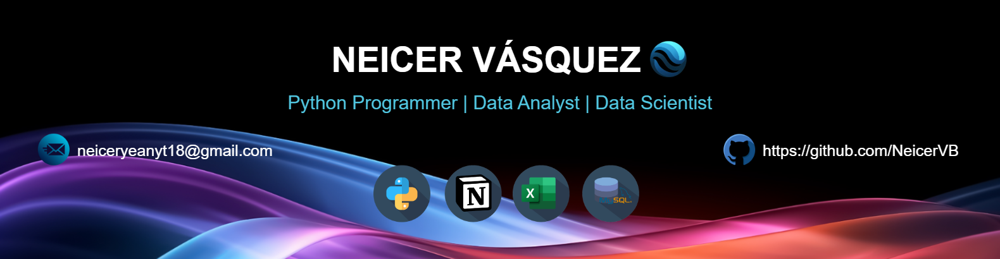

<h1 align='center'>Hola 👋, soy Neicer Vásquez Bermúdez / NeicerVB ✨</h1>

## 🧑‍💻 Sobre mí
Soy un __entusiasta de la tecnología y la programación__, me apasiona crear proyectos con __Python__ para automatizar procesos, analizar datos y desarrollar modelos de machine learning. Me considero una persona muy __curiosa y autodidacta__ que siempre busca aprender y dejarse maravillar por los avances tecnológicos.

## 🎓 Formación
- **Estudiante autodidacta** - Platzi - 2023-Actualidad
  - Ruta de Análisis y Manipulación de Datos con Python ✅
  - Ruta de Entorno de Trabajo para Data e IA ✅

## 💼 Competencias profesionales

- **Resolución de problemas**: Capacidad para identificar, analizar y resolver problemas complejos de manera eficiente, aplicando pensamiento lógico y creativo.

- **Autoaprendizaje**: Habilidad para adquirir nuevos conocimientos de forma autodidacta, manteniendo una constante actualización en tecnologías emergentes.

- **Análisis de datos**: Competencia para extraer, procesar y visualizar información valiosa a partir de conjuntos de datos, transformándolos en insights accionables.

- **Adaptabilidad tecnológica**: Adaptabilidad intermedia para aprender nuevas herramientas, lenguajes y frameworks según las necesidades de un proyecto.

- **Trabajo colaborativo**: Experiencia en el uso de herramientas de control de versiones (Git/GitHub) y metodologías que facilitan el trabajo en equipo.

- **Comunicación técnica**: Habilidad para explicar conceptos técnicos complejos de manera clara y comprensible a diferentes audiencias.

## 🚀 Habilidades
- **Python:** Nivel intermedio-avanzado.
- **Manejador de paquetes:** Uso de Anaconda para la gestión de paquetes y entornos virtuales.
- **Machine Learning:** Desarrollo de modelos de machine learning con Scikit-Learn.
- **Análisis de datos:** Manipulación y visualización de datos con Pandas, NumPy, Matplotlib y Seaborn.
- **Bases de datos:** Conocimientos en MySQL y PostgreSQL.
- **Git/GitHub:** Uso de control de versiones para el desarrollo colaborativo de proyectos.
- **Visual Studio Code:** Uso de este IDE para la programación y desarrollo de proyectos.
- **Notion:** Organización y gestión de proyectos y tareas.
- **Inglés:** Nivel A2.

## 🖥️ Tecnologías conocidas

  

## 📊 Estadísticas de GitHub

  

## 📨 Contacto

